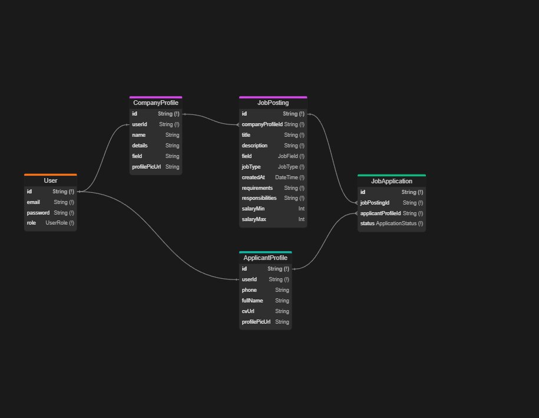

# JobSpot

JobSpot is a fullstack web application that helps applicants easily find and apply for jobs, while allowing companies to discover the right candidates.

Applicants can create profiles, submit applications, and track their progress throughout the hiring process.

## Table of Contents

- [Features](#features)
- [Installation](#installation)
- [Usage](#usage)
- [Technologies Used](#technologies-used)
- [Database Schema](#database-schema)
- [Contact](#contact)

## Work in Progress

JobSpot is currently a work in progress. Features and functionalities are being developed and improved. Contributions and feedback are welcome!

## Features

- User Authentication and Authorization
- Profile Completition Tracker
- Visual Analytics for Job Applications
- Filter & Search Applications
- Responsive Design

## Installation

- Clone the repository

```bash
https://github.com/IvoGeorgievx/JobSpot.git
```

- Run npm install in both jobspot-api and jobspot-client
- Create .env file in the api and fill your db credentials and jwt secret
- Install awslocal

```markdown
https://docs.localstack.cloud/user-guide/integrations/aws-cli/
```

- From the api folder run:

```bash
docker-compose up -d
```

- Run the migrations

```bash
npx prisma migrate deploy
```

- Create buckets

```bash
awslocal s3api create-bucket --bucket profile-pic-bucket
awslocal s3api create-bucket --bucket cv-bucket
```

- Allow CORS on the bucket

```bash
awslocal s3api put-bucket-cors --bucket cv-bucket --cors-configuration '{\"CORSRules\": [{\"AllowedOrigins\": [\"*\"], \"AllowedHeaders\": [\"*\"], \"AllowedMethods\": [\"GET\", \"PUT\", \"POST\", \"DELETE\"], \"MaxAgeSeconds\": 3000}]}'
```

- Run the api (from the api folder)

```bash
npm run start:dev
```

- Run the client (from the client folder)

```bash
npm run dev
```

## Usage

- For reference open the Swagger Documentation

```bash
  http://localhost:3000/api
```

## Technologies Used

- React (Frontend)
- NestJs (Backend)
- PostgreSQL (Database)
- Prisma (ORM)
- MUI (UI Components)
- Recharts (Data Visualization)
- JWT (Authentication)

## Database Schema



## Contact

- Created by [Ivaylo Georgiev](https://github.com/IvoGeorgievx) - Feel free to reach out.
